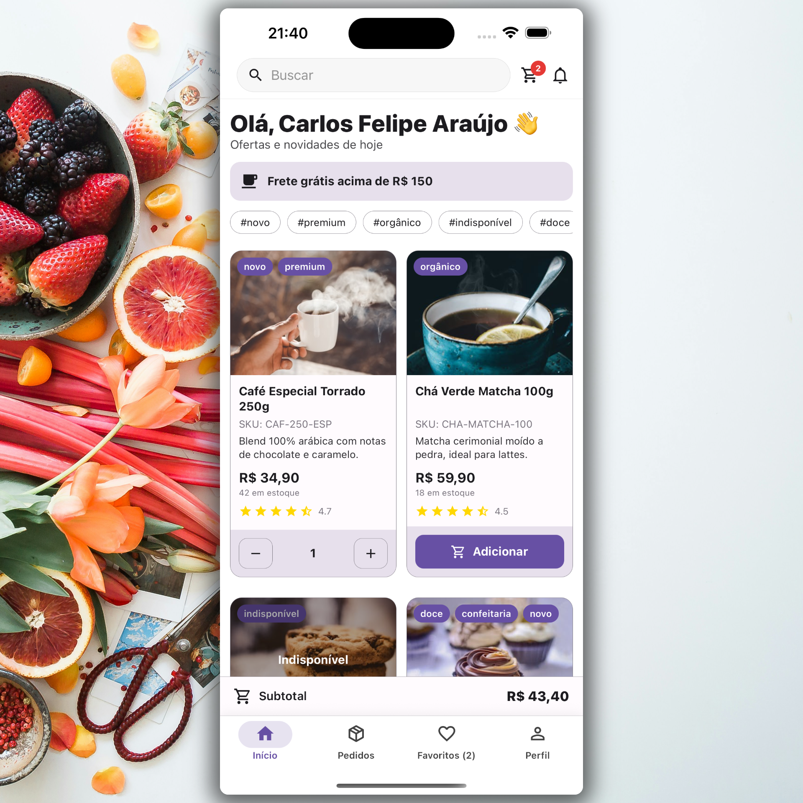
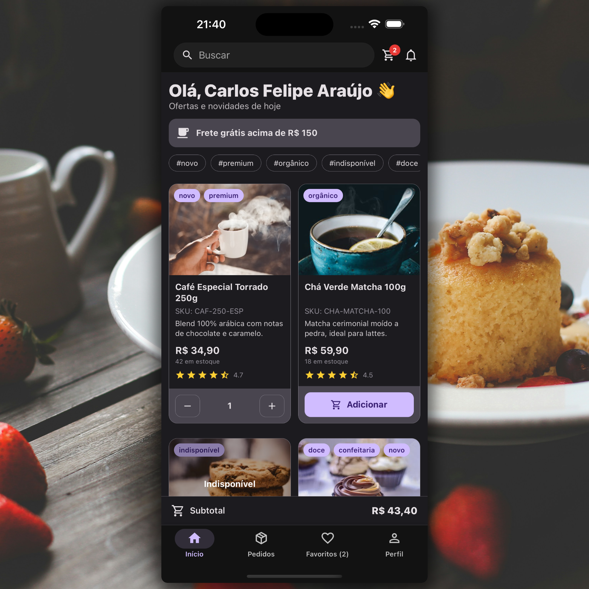

Este é o projeto **My Food**, desenvolvido em
[**React Native**](https://reactnative.dev), utilizando
[`@react-native-community/cli`](https://github.com/react-native-community/cli).

<p align="center">
  
</p>

<p align="center">
  
</p>

# Primeiros Passos

> **Nota**: Certifique-se de ter concluído o guia
> [Configurar seu Ambiente](https://reactnative.dev/docs/set-up-your-environment)
> antes de prosseguir.

## Etapa 1: Clonar o projeto e instalar dependências

Clone este repositório e entre na pasta do projeto:

```sh
git clone https://github.com/carlosxfelipe/my-food.git
cd my-food
```

Depois, instale as dependências do projeto:

```sh
# Usando npm
npm install

# OU usando Yarn
yarn install
```

## Etapa 2: Iniciar o Metro

Primeiro, você precisará executar o **Metro**, a ferramenta de build JavaScript
para React Native.

Para iniciar o servidor Metro, execute o seguinte comando a partir da raiz do
seu projeto React Native:

```sh
# Usando npm
npm start

# OU usando Yarn
yarn start
```

## Etapa 3: Construir e rodar seu app

Com o Metro em execução, abra uma nova janela/aba de terminal a partir da raiz
do seu projeto React Native e use um dos seguintes comandos para compilar e
rodar seu aplicativo Android ou iOS:

### Android

```sh
# Usando npm
npm run android

# OU usando Yarn
yarn android
```

### iOS

No iOS, lembre-se de instalar as dependências do CocoaPods (isso só precisa ser
feito no primeiro clone ou após atualizar dependências nativas).

Na primeira vez que você criar um novo projeto, execute o bundler do Ruby para
instalar o próprio CocoaPods:

```sh
bundle install
```

Depois, e sempre que atualizar suas dependências nativas, execute:

```sh
bundle exec pod install
```

Para mais informações, consulte o
[guia de introdução ao CocoaPods](https://guides.cocoapods.org/using/getting-started.html).

```sh
# Usando npm
npm run ios

# OU usando Yarn
yarn ios
```

## Licença

Este projeto é licenciado sob os termos da **GNU General Public License v3.0 or
later**.

Você pode ver a licença completa em [`LICENSE`](./LICENSE) ou acessá-la
diretamente [aqui](https://www.gnu.org/licenses/gpl-3.0.txt).

---

> Projeto desenvolvido com ❤️ por
> [@carlosxfelipe](https://github.com/carlosxfelipe). Contribuições são
> bem-vindas!
